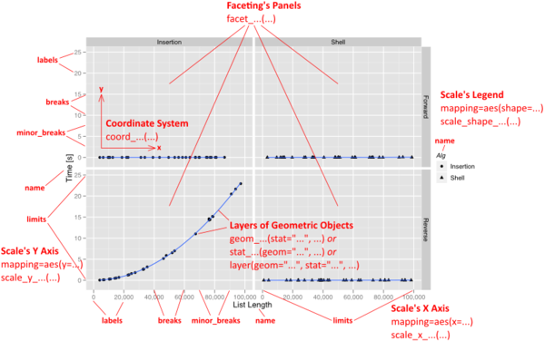
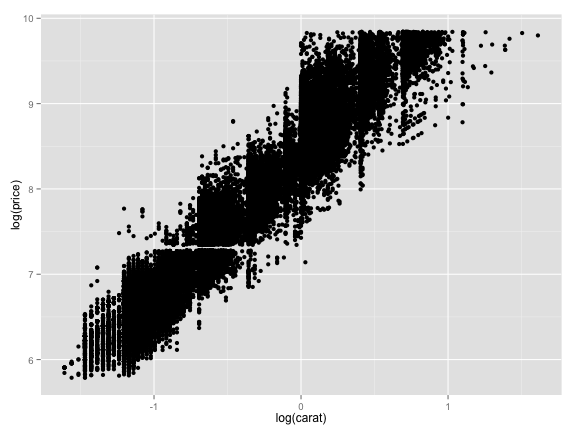
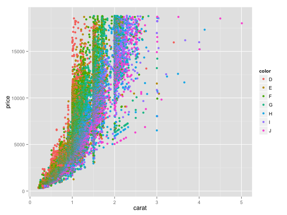
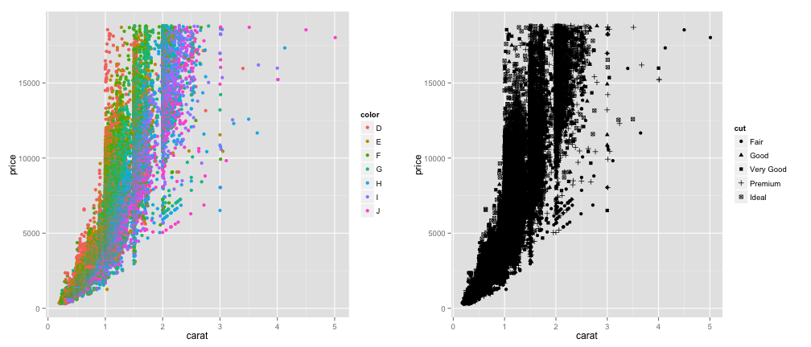
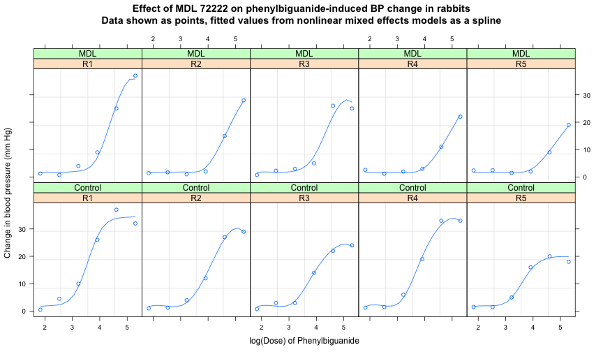
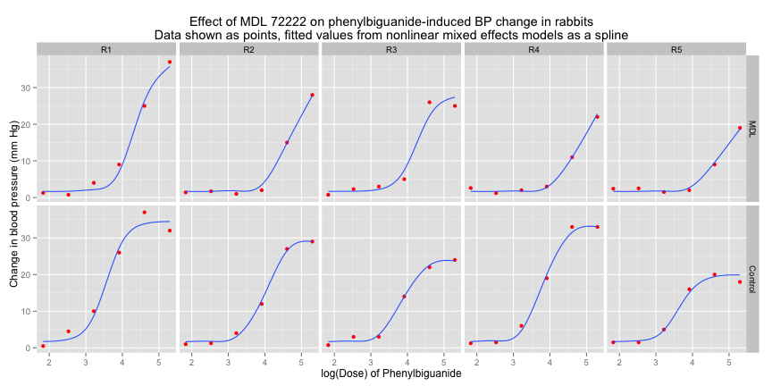

## grammar of graphics

Wilkinson (2005) created a grammar of graphics to describe the deep features that underlie all statistical graphics as "parts of speech": 
   >- The ```data``` that you want to visualise
   >- An aesthetic mapping, ```aes``` for short, describing how variables in the data are mapped to aesthetic attributes that you can perceive
   >- geometric objects, ```geoms``` for short, representing what you actually see on the plot: points, lines, polygons, etc
   >- optional statistical transformations, ```stats``` for short, summarising data in many useful ways, e.g.
      - binning and counting observations to create a histogram
      - summarising the relationship between two variables with a linear model

---

## grammar of graphics, cont'd

   >- a coordinate system, ```coord``` for short, describing how data coordinates are mapped to the plane of the graphic
      - also provides axes and gridlines to make it possible to read the graph
      - a Cartesian coordinate system, but a number of others are available, including polar coordinates and cartographic map projections
   >- ```scales``` which map values in the data space to values in one or more aesthetic spaces
      - indicate position in Cartesian or other 2-dimensional projections
      - encode values as colour, size or shape of symbols, lines
      - ```scales``` draw labelled axes and/or a legend
      - provide a reverse mapping to make it possible to read the original data values from the graph
   >- a ```facet``` specification describing how to break up the data into subsets and how to display those subsets as and arrangement of small multiples
    - known as conditioning or latticing/trellising ("panelling" in the Lattice package) 

---

## anatomy of a plot



Graphic by Software and Programmer Efficiency (Sape) Research Group at the Faculty of Informatics of the University of Lugano

---

## grammar not pronounciation

   >- the Wilkinson grammar of graphics does not include finer points of display
      - font size or background colour are not specified by the grammar
      - such attributes are analogous to pronounciation (or maybe typography?)
  
   >- ggplot2 specifies such attributes with a ```theming``` system
      - the default theme is very attractive, and thoughtfully designed
      - alternative themes come with the package
      - easy to tweak themes or design your own

   >- ggplot2 maintains a clean separation between:
      >- the ```data``` to be visualised
      >- the form of that visualisation (defined by the ```grammar```)
      >- how the rendered graphic looks (defined by the ```theme```)

---

## what ggplot2 doesn't do

   >- graphs are static, not interactive (e.g. brushing, zooming), but...
      - Hadley Wickham is rewriting ggplot2 in JavaScript, using the d3 library -> interactive graphs
      - the incremental, object-oriented nature of ggplot2 graphs make them ideal targets for interactive graph specification via Shiny or similar
   >- 3D graphics (cf lattice package for R)    
   >- exhaustive comparison of lattice vs ggplot2 capabilities and results in 12 parts at:
      - http://learnr.wordpress.com/2009/06/28/ggplot2-version-of-figures-in-lattice-multivariate-data-visualization-with-r-part-1/
      - ...through to...
      - http://learnr.wordpress.com/2009/08/18/ggplot2-version-of-figures-in-lattice-multivariate-data-visualization-with-r-part-13/

---

## ggplot2 versus other R graphics systems

>- base graphics in R
    - written by Ross Ihaka, University of Aukland, based on S graphics driver
    - use a pen-on-paper model: you can only draw on top of the plot, you cannot modify or delete existing content
    - no (user accessible) representation of the graphics, apart from their appearance on the screen
    - includes both tools for drawing primitives and entire plots.

>- grid graphics, a much richer system of graphical primitives, written in 2000 by Paul Murrell, also at University of Auckland
    - grid ```grobs``` (graphical objects) can be represented independently of the plot and modified later
    - viewports (each containing its own coordinate system) makes it easier to lay out complex graphics
    - provides drawing primitives, but no tools for producing statistical graphics

---

## ggplot2 versus other R graphics systems, cont'd

>- lattice package, developed by Deepayan Sarkar, uses grid graphics to implement the trellis graphics system of Bill Cleveland (1985)
    - easily produce conditioned plots
    - some plotting details (e.g., legends) taken care of automatically
    - but lacks a formal model, which can make it hard to extend (custom panel functions can be tricky to write)

>- ggplot (precursor to ggplot2), also developed at University of Auckland!
    - also uses grid graphics for underpinnings
    - formal grammar
    - far more modular and object-oriented
    - strong separation of data, grammar and themes

---
  
## installing ggplot2


```r
install.packages("ggplot2")
```


Optionally, some extra goodies

```r
install.packages("gridExtra")
install.packages("reshape2")
```


Don't forget to load the library

```r
library(ggplot2)
library(gridExtra)
```


---
  
## qplot()

>- mimics the ```plot()``` function in base graphics
>- don't use it
    - you miss out on all the good stuff in ggplot2
    - is fairly limited, so you'll end up learning the real ggplot2 functions anyway
>- by default creates a basic scatter plot
    - arguments: x variable, y variable, a data frame
>- all data used by ggplot2 needs to be in a data frame (cf base and lattice graphics)
    - but can use more than one data frame

---

## qplot()


```r
qplot(carat, price, data = diamonds)
```

 


---

## functions can be used on variables

- true throughout ggplot2


```r
qplot(log(carat), log(price), data = diamonds)
```

 


---

## additional arguments to modify qplot() output

```r
qplot(carat, price, data = diamonds, colour = color)
```

 


---

## ggplot2 graphics are objects


```r
p1 <- qplot(carat, price, data = diamonds, colour = color)
p2 <- qplot(carat, price, data = diamonds, shape = cut)
grid.arrange(p1, p2, ncol = 2)
```

 


---

## ggplot() - the real deal

- takes two arguments: a data frame, and an aesthetic mapping

```r
p <- ggplot(diamonds, aes(carat, price, colour = cut))
p
```


Hmmm, no output!

---

## need to add a geom


```r
p <- ggplot(diamonds, aes(carat, price, colour = cut))
p + geom_point()
```

 


---
## plots are R objects


```r
summary(p)
```

```
## data: carat, cut, color, clarity, depth, table, price, x, y, z
##   [53940x10]
## mapping:  x = carat, y = price, colour = cut
## faceting: facet_null() 
## -----------------------------------
## geom_point: na.rm = FALSE 
## stat_identity:  
## position_identity: (width = NULL, height = NULL)
```


- each element of the ggplot2 object can be modified or replaced by ggplot2 function
- or by your own custom functions

---

## replacing data in a plot object
- use the ```%+%```` operator to replace datasets in a graphic object


```r
p1 <- ggplot(mtcars, aes(mpg, wt, colour = cyl)) + geom_point()
mtcars2 <- transform(mtcars, mpg = mpg^2)
p2 <- p1 %+% mtcars2
grid.arrange(p1, p2, ncol = 2)
```

 


---

## aesthetic mappings can be added to geoms as well


```r
p1 <- ggplot(mtcars, aes(mpg, wt)) + geom_point(aes(colour = factor(cyl)), size = 5)
p2 <- p1 + geom_smooth()
p3 <- p1 + geom_smooth(aes(group = cyl, colour = factor(cyl)), method = "lm", 
    size = 1.5)
grid.arrange(p1, p2, p3, ncol = 3)
```

 


---

## override geom default statistical mappings


```r
p <- ggplot(diamonds, aes(carat))
p1 <- p + geom_histogram()
p2 <- p + geom_histogram(aes(y = ..density..), binwidth = 0.1)
grid.arrange(p1, p2, ncol = 2)
```

 


---

## mixing stats with geoms

```r
d <- ggplot(diamonds, aes(carat)) + xlim(0, 3)
d1 <- d + stat_bin(aes(ymax = ..count..), binwidth = 0.1, geom = "area")
d2 <- d + stat_bin(aes(size = ..density..), binwidth = 0.1, geom = "point")
d3 <- d + stat_bin(aes(y = 1, fill = ..count..), binwidth = 0.1, geom = "tile")
grid.arrange(d1, d2, d3, ncol = 3)
```


---

## mixing stats with geoms
 


---

## mixing stats with geoms

```r
x <- data.frame(x = rnorm(1000))
p <- ggplot(x, aes(x)) + geom_density()
p + stat_function(fun = dnorm, colour = "red")
```

 


---

## other geoms: boxplots


```r
p <- ggplot(mtcars, aes(factor(cyl), mpg))
p + geom_boxplot()
```

 


---

## other geoms: boxplots, violin plots, jittered points


```r
p1 <- p + geom_boxplot() + geom_jitter()
p2 <- p + geom_violin() + geom_jitter()
p3 <- p1 + geom_violin(alpha = 0.25, colour = "pink")
grid.arrange(p1, p2, p3, ncol = 3)
```

 


---

## other geoms: quantile regression (boxplot analogue for continuous variables)


```r
msamp <- movies[sample(nrow(movies), 1000), ]
p <- ggplot(msamp, aes(year, rating)) + geom_point()
p + geom_quantile()
```

 


---

## other geoms: boxplots + flipped co-ordinates


```r
p + geom_boxplot(outlier.colour = "green", outlier.size = 5) + coord_flip()
```

 


---

## variations on a scatter plot by substituting geoms


```r
rnorm.df <- data.frame(value = c(rnorm(300, mean = 0), rnorm(100, mean = 3)), 
    other_value = c(rnorm(300, mean = 0), rnorm(100, mean = 3)), mean = c(rep(0, 
        300), rep(3, 100)))
p <- ggplot(data = rnorm.df)
p <- p + aes(x = value, y = other_value)
p1 <- p + geom_point() + labs(title = "geom_point")
p2 <- p + geom_bin2d() + labs(title = "geom_bin2d")
p3 <- p + geom_point(alpha = 0.4) + geom_density2d() + labs(title = "geom_point + geom_density2d")
p4 <- p + geom_hex() + labs(title = "geom_hex")
grid.arrange(p1, p2, p3, p4, ncol = 2)
```


---

## variations on a scatter plot by substituting geoms

 


---

## fill, dodge, binhex


```r
p1 <- ggplot(diamonds, aes(x = clarity, fill = cut)) + geom_bar()
p2 <- ggplot(diamonds, aes(x = clarity, fill = cut)) + geom_bar(position = "dodge")
p3 <- ggplot(diamonds, aes(x = carat, y = price)) + geom_hex()
grid.arrange(p1, p2, p3, ncol = 3)
```

 


--- 

## different coordinate systems

```r
ggplot(diamonds, aes(clarity, fill = cut)) + geom_bar() + coord_polar()
```

 


---

## alpha channel blending


```r
p <- ggplot(data = mpg) + aes(x = cty, fill = factor(cyl))
p + geom_density(alpha = 0.5)
```

 


---

## maps


```r
crimes <- data.frame(state = tolower(rownames(USArrests)), USArrests)
require(maps)
states_map <- map_data("state")
ggplot(crimes, aes(map_id = state)) + geom_map(aes(fill = Assault), map = states_map) + 
    expand_limits(x = states_map$long, y = states_map$lat)
```

 


---
  
## maps with cartographic projections


```r
p <- last_plot()
p1 <- p + coord_map()  # defaults to Mercator projection
p2 <- p + coord_map("conic", lat0 = 20)
grid.arrange(p1, p2, ncol = 2)
```

 


---

## rasters


```r
# Generate data
pp <- function(n, r = 4) {
    x <- seq(-r * pi, r * pi, len = n)
    df <- expand.grid(x = x, y = x)
    df$r <- sqrt(df$x^2 + df$y^2)
    df$z <- cos(df$r^2) * exp(-df$r/6)
    df
}
p1 <- ggplot(data = pp(20), aes(x = x, y = y, fill = z)) + geom_raster()
p2 <- p1 %+% pp(200)
grid.arrange(p1, p2, ncol = 2)
```


---

## rasters

 


---
  
## predefined geoms

geom | description | geom | description
---------|----------|---------|----------
geom_abline | Line specified by a slope | geom_area | Area plot
geom_bar | Bar charts with bases on x-axis | geom_bin2d | Heat map of 2D binned values
geom_blank | Draws a blank | geom_boxplot | Box and whiskers plots
geom_contour | Display contours of a 3D surface in 2D | geom_crossbar | Hollow bar with middle indicated by horizontal line
geom_density | Display a smoothed density estimate | geom_density2d | Contours from a 2D density estimate
geom_dotplot | Dot plot, beloved of ABS | geom_errorbar | Error/CI bars
geom_errorbarh | Horizontal error bars | geom_freqpoly | Frequency polygon
geom_hex | Hexagon bining | geom_histogram | Histogram
geom_hline | Horizontal line | geom_jitter | Points, jittered to reduce over plotting
geom_line | Connect observations, ordered by x value | geom_linerange | An interval represented by a vertical line
geom_map | Polygons from a reference map | geom_path | Connect observations in original order

---
  
## predefined geoms, cont'd

geom | description | geom | description
---------|----------|---------|----------
geom_point | Scatterplot | geom_pointrange | An interval represented by a vertical line, with a point in the middle
geom_polygon | Polygon, a filled path, can also draw maps | geom_quantile | Add quantile lines from a quantile regression
geom_raster | High-performance rectangular tiling | geom_rect | Draw arbitrary 2D rectangles
geom_ribbon | Ribbons, y range with continuous x values | geom_rug | Marginal rug plots
geom_segment | Single line segments | geom_smooth | Add a smoothed conditional mean
geom_step | Connect observations by stairs (KM plots) | geom_text | Textual annotations
geom_tile | Tile plane with rectangles | geom_violin | Violin plot
geom_vline | Vertical line | |

---

## facets

>- facet_grid()
      - produces a 2D grid of panels defined by variables which form the rows and columns
      - layout like coplot in base graphics

>- facet_wrap()
      - produces a 1D ribbon of panels that is wrapped into 2D
      - layout like lattice graphics

>- facetting uses a formula interface, like lattice

>- options for changing facet order and labelling

---

## no facets


```r
mpg2 <- subset(mpg, cyl != 5 & drv %in% c("4", "f"))
ggplot(data = mpg2, aes(cty, hwy)) + geom_point()
```

 


---

## facets


```r
ggplot(data = mpg2, aes(cty, hwy)) + geom_point() + facet_grid(. ~ cyl)
```

 


---

## facets


```r
ggplot(data = mpg2, aes(cty)) + geom_histogram(binwidth = 2) + facet_grid(cyl ~ 
    .)
```

 


---

## facets


```r
ggplot(data = mpg2, aes(cty, hwy)) + geom_point() + facet_grid(drv ~ cyl)
```

 


---

## facets: label with varaiable name and value


```r
ggplot(data = mpg2, aes(cty, hwy)) + geom_point() + facet_grid(drv ~ cyl, labeller = label_both)
```

 


---

## nested facets


```r
ggplot(data = mpg2, aes(cty, hwy)) + geom_point() + facet_grid(. ~ cyl + drv, 
    labeller = label_both)
```

 


---

## custom labellers


```r
cyl_drv_custom_labeller <- function(variable, value) {
    if (variable == "cyl") {
        return(paste(value, "cylinders"))
    } else if (variable == "drv") {
        drv.types <- list(`4` = "4WD", f = "Front-wheel drive")
        return(drv.types[value])
    }
}
ggplot(data = mpg2, aes(cty, hwy)) + geom_point() + facet_grid(. ~ cyl + drv, 
    labeller = cyl_drv_custom_labeller)
```


---

## custom labellers

 


---

## facets with marginals


```r
p <- ggplot(data = mpg2, aes(displ, hwy)) + geom_point(alpha = 0.25)
p <- p + geom_smooth(method = "lm", se = F)
p1 <- p + facet_grid(cyl ~ drv)
p2 <- p + facet_grid(cyl ~ drv, margins = T)
grid.arrange(p, p1, p2, ncol = 3)
```


---

## facets with marginals

 


---

## facets with free scales

```r
p <- ggplot(data = mpg, aes(cty, hwy)) + geom_point(alpha = 0.25)
p1 <- p + facet_wrap(~cyl)
p2 <- p + facet_wrap(~cyl, scales = "free")
grid.arrange(p1, p2, ncol = 2)
```

 


---

## parsed labels


```r
mtcars$cyl2 <- factor(mtcars$cyl, labels = c("alpha", "beta", "gamma"))
p1 <- ggplot(data = mtcars, aes(wt, mpg)) + geom_point() + facet_grid(. ~ cyl2)
p2 <- p1 + facet_grid(. ~ cyl2, labeller = label_parsed)
grid.arrange(p1, p2, ncol = 2)
```

 


---

## facetted maps


```r
crimes.melted <- melt(crimes, id = 1)
ggplot(crimes.melted, aes(map_id = state)) + geom_map(aes(fill = value), map = states_map) + 
    expand_limits(x = states_map$long, y = states_map$lat) + coord_map() + facet_wrap(~variable)
```

 

---

## annotations


```r
p <- ggplot(mtcars, aes(x = wt, y = mpg)) + geom_point()
p + annotate("text", x = 4, y = 25, label = "Some text")
```

 


---

## annotations


```r
p + annotate("rect", xmin = 3, xmax = 4.2, ymin = 12, ymax = 21, alpha = 0.2)
```

 


---

## data-driven annotations


```r
p <- ggplot(mtcars, aes(x = wt, y = mpg, label = rownames(mtcars))) + geom_point()
p + geom_text(aes(colour = factor(cyl))) + scale_colour_discrete(l = 40)
```

 


---

## colour palettes


```r
p1 <- ggplot(diamonds[sample(nrow(diamonds), 1000), ], aes(x = carat, y = price, 
    colour = clarity)) + geom_point()
p2 <- p1 + scale_colour_brewer()
p3 <- p1 + scale_colour_grey()
grid.arrange(p1, p2, p3, ncol = 3)
```

 


---

## themes


```r
p1 <- ggplot(diamonds, aes(x = clarity, fill = cut)) + geom_bar()
p2 <- p1 + theme_bw()
p3 <- p2 + scale_fill_grey()
grid.arrange(p1, p2, p3, ncol = 3)
```

 


--- 

## more themes


```r
p1 <- ggplot(diamonds, aes(x = clarity, fill = cut)) + geom_bar()
p2 <- p1 + theme_classic()
p3 <- p1 + theme_minimal()
grid.arrange(p1, p2, p3, ncol = 3)
```

 

---

## customised themes


```r
p1 <- ggplot(iris, aes(Sepal.Width, Sepal.Length)) + geom_point(aes(color = Species))
p2 <- p1 + theme(panel.background = element_rect(fill = "green"))
p2 <- p2 + theme(panel.grid.major = element_line(colour = "black")) + labs(title = "Yuk!")
grid.arrange(p1, p2, ncol = 2)
```

 


---

## non-linear mixed model from MASS: lattice vs ggplot2

* example from W.N Venables and B.D. Ripley (1999). Modern Applied Statistics with S-PLUS (MASS), 3rd Ed. Springer. Section 8.8, pp273-7

* first estimate starting parameters


```r
require(MASS, nlme, splines, lattice)
Fpl <- deriv(~A + (B - A)/(1 + exp((log(d) - ld50)/th)), c("A", "B", "ld50", 
    "th"), function(d, A, B, ld50, th) {
})
st <- nls(BPchange ~ Fpl(Dose, A, B, ld50, th), start = c(A = 25, B = 0, ld50 = 4, 
    th = 0.25), data = Rabbit)
st.pars <- st$m$getPars()
```


---

## non-linear mixed model from MASS: lattice vs ggplot2

fit several mixed models


```r
Rc.nlme <- nlme(BPchange ~ Fpl(Dose, A, B, ld50, th), fixed = list(A ~ 1, B ~ 
    1, ld50 ~ 1, th ~ 1), random = A + ld50 ~ 1 | Animal, data = Rabbit, subset = Treatment == 
    "Control", start = list(fixed = st.pars))
Rm.nlme <- update(Rc.nlme, subset = Treatment == "MDL")
options(contrasts = c("contr.treatment", "contr.poly"))
c1 <- c(28, 1.6, 4.1, 0.27, 0)
R.nlme1 <- nlme(BPchange ~ Fpl(Dose, A, B, ld50, th), fixed = list(A ~ Treatment, 
    B ~ Treatment, ld50 ~ Treatment, th ~ Treatment), random = A + ld50 ~ 1 | 
    Animal/Run, data = Rabbit, start = list(fixed = c1[c(1, 5, 2, 5, 3, 5, 4, 
    5)]))
R.nlme2 <- update(R.nlme1, fixed = list(A ~ 1, B ~ 1, ld50 ~ Treatment, th ~ 
    1), start = list(fixed = c1[c(1:3, 5, 4)]))
```


---

## non-linear mixed model from MASS - lattice


```r
xyplot(BPchange ~ log(Dose) | Animal * Treatment, Rabbit, xlab = "log(Dose) of Phenylbiguanide", 
    ylab = "Change in blood pressure (mm Hg)", subscripts = T, aspect = "fill", 
    main = title, panel = function(x, y, subscripts) {
        panel.grid()
        panel.xyplot(x, y)
        sp <- spline(x, fitted(R.nlme2)[subscripts])
        panel.xyplot(sp$x, sp$y, type = "l")
    })
```


---

## non-linear mixed model from MASS - ggplot2


```r
Rabbit2 <- cbind(Rabbit, fitted = fitted(R.nlme2))
p <- ggplot(data = Rabbit2, aes(x = log(Dose), y = BPchange))
p <- p + labs(title = title, x = "log(Dose) of Phenylbiguanide", y = "Change in blood pressure (mm Hg)")
p <- p + geom_point(colour = "red") + facet_grid(Treatment ~ Animal, as.table = F)
p <- p + geom_smooth(aes(y = fitted), method = "lm", formula = y ~ ns(x, df = 5), 
    se = F)
p
```


---

## non-linear mixed model from MASS - lattice

 


---

## non-linear mixed model from MASS - ggplot2

 


--- 

## summary

>- ggplot2 a viable alternative to base R graphics and the lattice package
>- still some gaps
>- very sensible defaults: graphs look nice without fiddling
>- very customisable, graphs are just R objects
>- built on a principled grammar of graphics
>- excellent web site, links to the book, tutorials: http://ggplot2.org
>- really excellent web documentation with lots of examples: http://docs.ggplot2.org/current/
>- dedicated mailing list, but lots of support and examples on StackOverflow etc

---

## enough!


